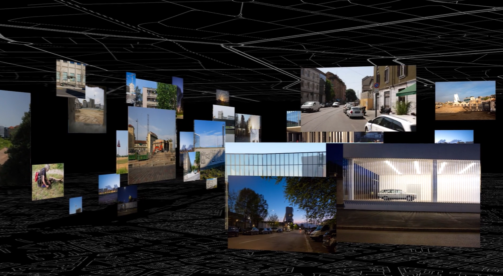

# Titolo
**Entanglement Urbano**: Riconnettere la Piazza attraverso l’Interazione

“La piazza non è mai solo un luogo, ma un intreccio di relazioni.”

[Video di Prospekt Photo](https://www.prospektphoto.net/)

[Vai al Video](https://vimeo.com/757082707){ .md-button }

# Obiettivo del Progetto
Progettare e realizzare un’opera interattiva / multimediale che interpreti il concetto di entanglement come metafora delle relazioni sociali, culturali e storiche che attraversano una piazza. L’opera dovrà evidenziare i legami visibili e invisibili tra i diversi attori che vivono, attraversano e trasformano questo spazio pubblico.

# Scenario di Partenza
La piazza, da sempre cuore della vita comunitaria, rappresenta un punto di convergenza tra persone, storie, culture e attività. I layer, i diversi strati di attraversamento e di lettura di questo luogo sono molteplici, ma mai paralleli e lineari, spesso questi piani rimangono disconnessi o poco visibili, altre volte si intrecciano trovando dei punti se non degli spazi di intersezione. Attraverso il potenziale delle tecniche e tecnologie, interattive e multimediali, il progetto intende dare voce a queste relazioni e stimolare nuovi modi di percepire e vivere lo spazio pubblico.

# Richieste Progettuali
## Approccio Multidimensionale
- Analizzare i diversi piani culturali e sociali che attraversano la piazza scelta (es. memorie storiche, interazioni quotidiane, conflitti sociali, diversità culturali).
- Integrare nella narrazione interattiva la complessità di questi piani, valorizzando sia le connessioni che le differenze.
## Interattività e Coinvolgimento
- Progettare un’opera che coinvolga attivamente gli utenti, rendendoli parte del sistema interattivo (es. attraverso suoni, luci, dati o elementi tangibili).
- Favorire relazioni tra le persone nello spazio fisico, andando oltre la semplice fruizione individuale.
## Entanglement come Metafora
- Utilizzare il concetto di entanglement per rappresentare la connessione tra elementi apparentemente distanti o indipendenti. Ad esempio, legare storie del passato con esperienze del presente, oppure connettere gruppi sociali diversi attraverso l’interazione.
##  Tecnologia e Sostenibilità
- Integrare tecnologie sostenibili e a basso impatto ambientale.
- Garantire accessibilità all’opera per utenti con diverse abilità (inclusività sensoriale e fisica).
## Ricerca e Documentazione
- Mappare gli attori e le dinamiche della piazza: chi la attraversa, chi la vive, quali sono le sue funzioni formali e informali.
- Utilizzare strumenti di osservazione, interviste e analisi del contesto per creare una base narrativa solida e autentica.
# Fasi di Sviluppo
## Ricerca sul Campo
- Selezionare una piazza reale come caso studio.
- Documentare storie, flussi, usi e pratiche sociali che caratterizzano lo spazio.
## Concept Design
- Elaborare un concept che traduca in un’esperienza interattiva il tema dell’entanglement e delle relazioni in piazza.
- Sviluppare uno storyboard che descriva il percorso dell’utente nell’opera.
## Prototipazione
- Realizzare un prototipo funzionante (fisico o digitale) per testare le principali dinamiche interattive.
- Coinvolgere un piccolo gruppo di persone per valutare l’esperienza e raccogliere feedback.
## Produzione Finale
- Sviluppare l’opera interattiva definitiva.
- Implementare soluzioni estetiche, tecnologiche e narrative che si integrino armoniosamente nello spazio della piazza.
## Installazione e Documentazione
- Installare l’opera nella piazza scelta per una fruizione pubblica.
- Documentare l’interazione degli utenti e l’impatto generato attraverso foto, video e interviste.
# Output Richiesti
1. Concept scritto e visuale (moodboard, schizzi, mappe concettuali).
2. Prototipo interattivo funzionante.
3. Relazione finale che descriva il processo di progettazione, i risultati della ricerca e l’impatto dell’opera sul pubblico.
# Criteri di Valutazione
1. Innovatività del Concept: capacità di rappresentare l’entanglement in modo originale e significativo.
2. Qualità dell’Interattività: grado di coinvolgimento e connessione tra gli utenti.
3. Rispondenza al Contesto: integrazione dell’opera nel contesto sociale e culturale della piazza scelta.
4. Sostenibilità e Accessibilità: attenzione agli aspetti ecologici e inclusivi.
5. Documentazione e Presentazione: chiarezza e completezza nella descrizione del processo progettuale.